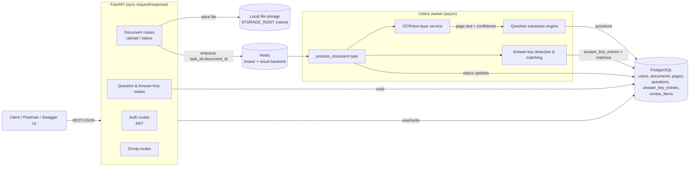

# Architecture & Design Decisions

## 1. Overall architecture

The API is a normal synchronous FastAPI app (SQLAlchemy sync sessions — simplest
correct option at this scale; see [Trade-offs](#trade-offs-and-limitations)). Upload
requests never block on processing: the endpoint validates and stores the file,
inserts a `Document` row with `status=pending`, enqueues a Celery task keyed by the
document id, and returns `202 Accepted` immediately. All heavy lifting (OCR, parsing,
answer-key matching) happens in the Celery worker process, decoupled via Redis.

## 2. Document-processing approach

`app/workers/tasks.py:process_document` is the single pipeline entry point:

1. Load the `Document`, flip status to `processing`.
2. `services/ocr.extract_pages` — page-by-page text extraction (see §3).
3. Persist one `Page` row per page (raw text, extraction method, OCR confidence,
   rendered image path, rotation applied).
4. `services/answer_key.find_answer_key_section` — heuristically locates an
   answer-key section (by heading, or by a density heuristic if no heading exists)
   *within this same document*, and classifies the whole document as
   `role=answer_key` if that section covers ≥60% of its pages.
5. If it's a question paper: `services/extraction.extract_questions` on the
   remaining (non-answer-key) pages; each result becomes a `Question` row plus zero
   or more `ReviewItem` rows explaining any confidence deductions.
6. If it's (or contains) an answer key: `services/answer_key.parse_answer_key`
   produces `AnswerKeyEntry` rows.
7. Status flips to `completed` (or `failed`, with the exception captured in
   `error_message` and a `critical` `ReviewItem`, on any error).
8. `match_answers_for_scope` re-runs on every document completion, joining
   `Question` and `AnswerKeyEntry` rows by `question_number` within the same
   `DocumentGroup` (or within the single document if ungrouped) — this is what lets
   a question paper and a *separately uploaded* answer key resolve answers for each
   other regardless of upload order.

## 3. OCR / AI technology choices

| Input | Method |
|---|---|
| Digital PDF page with a usable text layer (≥20 chars) | `PyMuPDF` (`fitz`) `page.get_text()` — fast, exact, no OCR error |
| Scanned PDF page / standalone image | Rendered to PNG (`PyMuPDF`/`pdf2image`), auto-rotated via Tesseract OSD, OCR'd with `pytesseract` (grayscale-converted); per-page average word confidence stored |

**Why Tesseract over a hosted vision/document-AI API:** it requires no external
credentials, runs fully offline (relevant to §9 "protection of external OCR/AI
credentials" — there's nothing to leak if you don't call an external service), has
no per-page cost, and its confidence scores integrate directly into this
system's own review pipeline. The trade-off is quality on genuinely difficult scans
(handwriting, heavy skew, low-resolution photos) versus a modern vision-LLM. The
codebase isolates this choice behind `services/ocr.py`; swapping in a hosted
OCR/Document-AI provider (or an LLM vision call) means changing one module, not the
pipeline. `GROQ_API_KEY` is wired into config as a placeholder for exactly this
kind of pluggable upgrade, but is **not required** — the system is fully functional
with zero external AI credentials, satisfying "AI tools are permitted" without
making them mandatory.

**Why rule-based extraction over an LLM for question parsing:** deterministic,
zero marginal cost, zero external dependency, and — critically — its failure modes
are legible: every confidence deduction traces to a named regex/heuristic check
(`missing_question_number`, `only_one_option_detected`, etc.), which is exactly
what §6 ("Confidence & Validation") asks for. An LLM-based extractor would likely
extract *more* irregular formats correctly, at the cost of opaque failures and a
per-document API cost/credential. See [Trade-offs](#trade-offs-and-limitations).

## 4. Storage design

- **Files**: local disk under `STORAGE_ROOT/{owner_id}/{document_id}/original.{ext}`,
  with rendered/OCR page images alongside in `.../pages/`. Docker Compose mounts
  this as a named volume (`storage_data`) so it survives container restarts. Path
  is namespaced by owner id first, so a path-traversal or id-guessing attempt still
  can't cross into another user's directory without also guessing their user id
  (defense in depth on top of the DB-level ownership check that actually gates
  access).
- **Metadata & extracted data**: PostgreSQL, via SQLAlchemy models — `users`,
  `document_groups`, `documents`, `pages`, `questions`, `answer_key_entries`,
  `review_items`. `options`, `images`, and `source_pages` on `Question` are `JSONB`
  columns rather than child tables — they're small, always read/written as a unit
  with their parent question, and never queried independently, so normalizing them
  would add join overhead for no query benefit.
- Swapping local disk for S3/GCS is a change contained to `services/storage.py`
  (returns a path/URI) plus how `ocr.py` opens files; nothing else references the
  filesystem directly.

## 5. Asynchronous processing

Celery + Redis (broker + separate result-backend DB). The task is keyed by
`document_id` (a string), not by any in-memory object, so it's safe to retry/replay
and safe across worker restarts — all state lives in Postgres, not in the task
payload. `docker-compose.yml` runs the worker as an independent, horizontally
scalable service (`--concurrency=2`; bump this or run multiple `worker` replicas to
process documents concurrently, which directly satisfies §10's "architecture should
support documents being processed concurrently").

## 6. Question extraction strategy

`services/extraction.py`:

1. Concatenate all page texts into one string, interleaving an invisible page
   marker (`\x00PAGE:<n>\x00`) at each page boundary — this lets the splitter
   recover which page(s) contributed to each question after all the text has been
   joined, which is what makes multi-page question detection possible without ever
   losing the source-page link.
2. Split on a question-number pattern that accepts `1.`, `1)`, `Q1.`, `Q.1`,
   `Question 1:`, etc.
3. Within each question's block, split stem vs. options on an option-line pattern
   accepting `A)`, `A.`, `(A)`, lowercase, etc.
4. Classify type: `true_false` (regex for "True/False"), `mcq_single`/`mcq_multi`
   (≥2 options; multi if the stem says "select all"/"choose all"), `short_answer`
   (no options detected), else `unknown`.
5. Score confidence (1.0 start, deductions for: no question number, missing/short
   question text, fewer than 2 options when any were found, spanning multiple
   pages, low average OCR confidence for the source pages) and classify status:
   `success` (≥0.75), `partial` (≥0.45), else `review`.
6. If a document has question-number matches nowhere at all, the whole page/document
   becomes a single `review`-flagged fragment — text is never silently dropped even
   when it can't be segmented.

## 7. Answer-key association

`services/answer_key.py` + `match_answers_for_scope` in the worker:

- **Locating the key**: an explicit heading (`Answer Key`, `Answers`, `Key`,
  `Solutions`) marks everything from that page onward; absent a heading, a page is
  still treated as an answer key if ≥50% of its non-blank lines match a
  `<number><punct><letter>` pattern (`1. A`, `1) B`, `1 - C`, `1: D`, `Q1 - A`) — this
  covers answer keys with no heading at all.
- **Location independence**: this heuristic runs per-page, so it works whether the
  key is at the front, the back, or scattered — and it's applied independently to
  every document in a group, so it works identically whether the key is a trailing
  section of the *same* PDF or a wholly separate uploaded file.
- **Cross-document matching**: `Question` and `AnswerKeyEntry` rows both carry a
  nullable `group_id`. `match_answers_for_scope` joins them by
  `question_number` within that scope (or within a single document if it wasn't
  grouped) every time *any* document in the group finishes processing — so upload
  order between the paper and its key doesn't matter.
- **Uncertain answers are never guessed**: a `Question` with a number but no
  matching `AnswerKeyEntry` gets `answer=null` plus an `unmatched_answer`
  `ReviewItem`, rather than a fabricated or blank-but-unexplained answer.

## 8. Confidence / review mechanism

- `Question.status` ∈ `{success, partial, review}`, driven by the numeric
  `Question.confidence` (0–1) — see thresholds in §6.
- `Question.answer_confidence` is set from the matched `AnswerKeyEntry`'s own
  confidence, capped by the question's own confidence, so a shaky OCR'd question
  can't inherit an unearned high answer-confidence.
- `ReviewItem` is the audit trail: one row per concern
  (`low_ocr_confidence`, `rotation_corrected`, `missing_question_number`,
  `unmatched_answer`, `no_questions_extracted`, `answer_key_unparseable`,
  `processing_failed`, …), each with a `severity` (`info`/`warning`/`critical`) and
  a human-readable message, linked to the specific `document_id` and, where
  applicable, `question_id`. `GET /documents/{id}/review-items` surfaces the full
  list for a human reviewer.
- **Traceability back to source**: every `Question` carries `source_pages` (the
  exact page numbers it was built from) and every `Page` retains its `image_path`
  (for OCR'd pages) and `raw_text`, so a reviewer can always pull up the original
  page image/text next to a flagged question.

## 9. Security considerations

- **Auth**: JWT (HS256), OAuth2 password flow (`passlib`/`bcrypt` hashing). Token
  required on every document/question/group route via a FastAPI dependency.
- **Authorization**: every document/question/group lookup filters by
  `owner_id == current_user.id` (or resolves the parent document's owner first) and
  returns `404` — not `403` — on mismatch, to avoid confirming a resource's
  existence to a non-owner.
- **Upload validation**: extension allow-list *and* magic-byte sniffing (so a
  `.pdf` that isn't actually a PDF, e.g. a renamed executable, is rejected even
  though its extension looks fine), streamed size-limit enforcement (rejects
  mid-stream rather than buffering an oversized file fully into memory first),
  empty-file rejection.
- **Storage isolation**: files are written under `STORAGE_ROOT/{owner_id}/{document_id}/`
  with a fixed filename (`original.<ext>`) derived from the validated extension —
  the original filename (attacker-controlled) is never used as a path component,
  which rules out path traversal via a crafted filename.
- **Secrets**: all credentials/config are environment-based (`.env`, gitignored);
  `.env.example` documents every variable with placeholder values only. No secrets
  are committed. `GROQ_API_KEY` (unused by default) would flow the same way if
  ever enabled — never embedded in code or logged.
- **Error handling**: global handlers normalize both HTTP and validation errors to
  a consistent `{"detail": ...}` JSON shape (no stack traces leak to clients);
  worker-side exceptions are caught, rolled back, and recorded as `failed` +
  `critical` `ReviewItem` rather than crashing the worker process.

## 10. Scalability considerations

- **Horizontal**: the API is stateless (JWT, no server-side session) — run N
  replicas behind a load balancer. The Celery worker is likewise stateless per-task
  (all state in Postgres) — run N worker replicas/concurrency for parallel document
  processing; Celery's Redis-backed queue naturally load-balances tasks across them.
- **Vertical/isolation**: OCR is the expensive step; because it's isolated in a
  separate worker process (not in the API's request/response path), a slow/heavy
  document never blocks API responsiveness for other users.
- **Database**: indexes on all foreign keys used in lookups
  (`owner_id`, `group_id`, `document_id`, `question_id` on `review_items`) keep the
  common queries (list my documents, list a document's questions, list a group's
  questions) index-backed as data grows.
- **Storage**: local disk is the simplest correct choice at assignment scale; the
  storage layer is isolated behind one module specifically so it can move to
  S3/GCS (which would also let multiple API/worker replicas share a filesystem
  without a shared volume) without touching the rest of the app.

## 11. Trade-offs and limitations

- **Rule-based extraction, not ML/LLM-based**: this trades recall on very
  irregular/unusual formats for full determinism, zero external cost, and legible
  confidence scoring. A format the regexes don't recognize lands in `review` status
  with its raw text preserved — it is never silently dropped or misparsed with
  false confidence. Layering an LLM-based extractor as a second pass (only on
  `review`-status output) would be the natural next iteration.
- **Sync SQLAlchemy, not async**: simpler and equally correct at this scale (a
  handful of demo documents); a high-throughput deployment would move to
  `asyncpg`/async SQLAlchemy sessions, which is a mechanical change given how thin
  the route handlers already are.
- **No image/table cropping**: `Question.images` exists in the schema for
  associating extracted diagram/table crops with a question, but this
  implementation doesn't yet run image-region detection — it stores whole rendered
  page images at the `Page` level (referenceable via `source_pages`), which is
  enough for a human reviewer to verify against, but doesn't crop the specific
  figure out of the page.
- **Answer-key heuristics can mis-classify**: a document that is *mostly* short
  numbered lines but isn't actually an answer key (e.g., a very terse question
  list) could trip the ≥50%-density fallback heuristic. This is a precision/recall
  trade-off documented here rather than hidden; the `answer_key_unparseable`
  review item catches the (much more common) opposite failure — classified as a
  key but unparseable.
- **Local disk storage**: durable via a Docker volume for this deployment, but not
  itself replicated/multi-region; see §10 for the swap-in path to object storage.

## Testing

`app/tests/test_extraction.py` and `test_answer_key.py` are pure unit tests (no I/O).
`test_api_documents.py` exercises the real FastAPI app end-to-end (register → login →
upload → Celery task run synchronously in-process → poll status → fetch questions),
against a real Postgres database (`docuquest_test`) rather than SQLite, because the
schema relies on Postgres-specific types (`UUID`, `JSONB`, native `ENUM`) that SQLite
can't represent — a mocked/sqlite DB would validate a different schema than the one
actually deployed, which defeats the point of an integration test.
